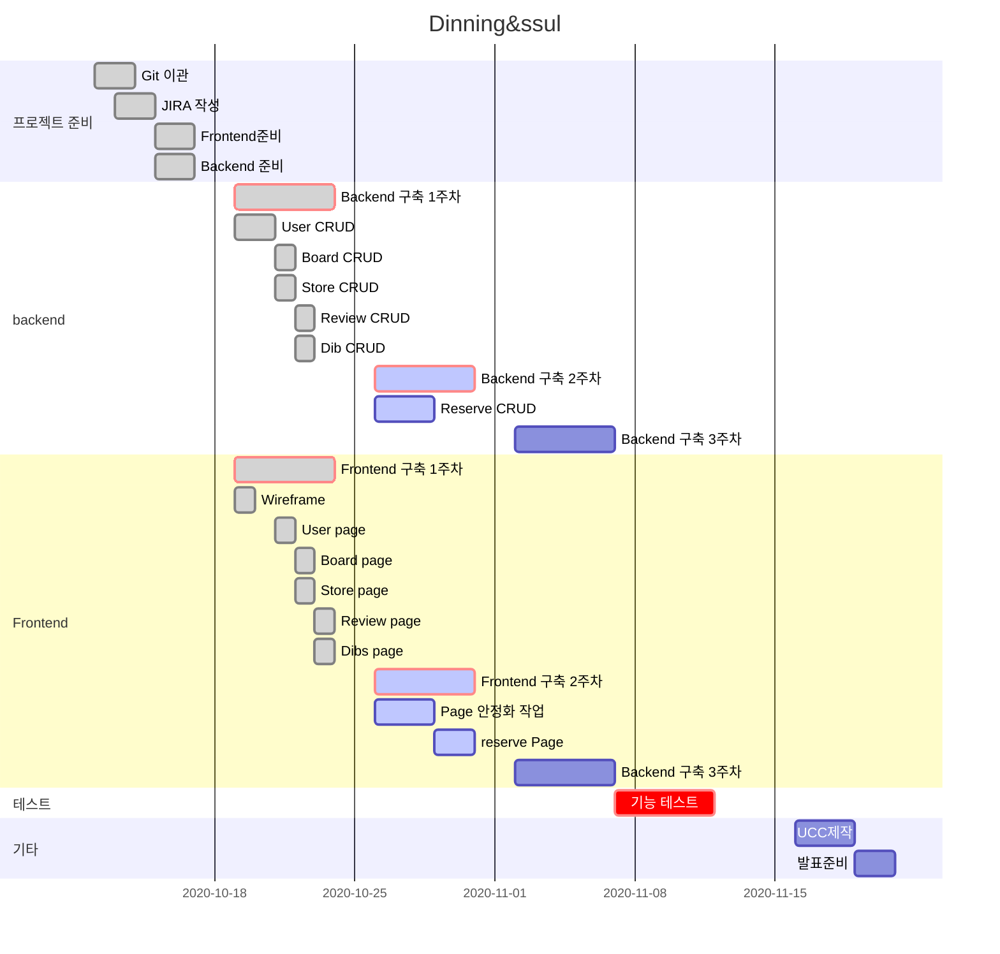

<h1 align="center">Welcome to 완벽한 맛남 👋</h1>

  
  

Front & Back

   
   
    
    
    
    
    
    

Env

    
    
    
    
    
    
    

> 완벽한 맛남을 위한 완벽한 장소를 `완벽한 맛남`에서 찾아보세요~

### 🏠

## What it is

상견례에 적합한 장소를 고민하지 않고 pick! 

## Main Feature

- BIGDATA를 이용한 목적에 맞는 식당 데이터

- 소셜 oauth 를 통한 로그인 구현

- 검색 기능을 통한 맛집 리스트 보기

- 리뷰를 통한 신뢰도 up

  

## Develop Period

- 20201005-20201120

## Git-flow 전략

- master : 최종 제출할 브랜치

- release : 최종 제출 전 정리하는 브랜치

- feature/front/*: Frontend 기능을 개발하는 브랜치

- feature/back/*: Backend 기능을 개발하는 브랜치

## Develop rule

1. 개발을 시작하기 전에 JIRA를 작성한다.

2. 공유하는 브랜치의 커밋 그래프는 함부로 변경하지 않는다.
 
3. 팀원에게 꼭 리뷰를 받는다.

4. 자신의 Pull Request는 스스로 merge한다.

## Gantt Chart

## 기술 스택

- Front-end: Vue.cli, node.js, Vuetify, Vuex, bootstrap
- Back-end: Python,Spring
- Env & etc: AWS-EC2, labssafy, Jira, Jenkins
- API를 이용하여 서버 구동
- Oauth2.0을 이용한 소셜 로그인
- Vue.cli와 router를 이용하여 SPA를 구현함으로써 빠른 UI/UX 향상

## Author

👨 **Youngwook Go**

* Github: [@gyw8526](https://github.com/gyw8526)

👩  **Yunji Na**

* Github: [@dmdekf](https://github.com/dmdekf)

👨 **Sung Hyeon Lee**

* Github: [@lshmn951](https://github.com/lshmn951)

👨 **Hyung jin Jeon**

* Github: [@wjsgudwls89](https://github.com/wjsgudwls89)

👨 **Myung Hun Kang**

* Github: [@MHKANG](https://github.com/MHKANG)

## Show your support

Give a ⭐️ if this project helped you!

## 📝 License

Copyright © 2020 Youngwook Go, Yunji Na, Soyun Jeon, Hyung jin Jeon

***
_This README was generated with ❤️ by [readme-md-generator](https://github.com/kefranabg/readme-md-generator)_

